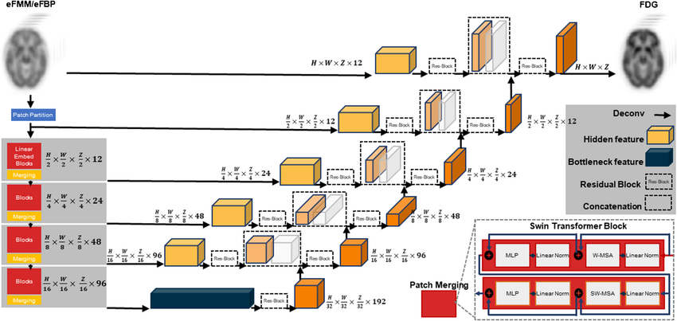

# cura-Swin-UNETR-bts

  

# About the Project

CURA is a brain tumor (glioblastoma) segmentation pipeline based on Swin-UNETR. This architecture combines Swin Transformers as encoders with UNet-like decoders. Swin-UNETR hybrid models have achieved top-tier performance in the BraTS (Brain Tumor Segmentation) challenges, including BraTS 2021, thanks to their ability to model both local detail and global context in 3D medical images.

Swin-UNETR outperforms standard convolutional models by employing the self-attention mechanism to detect subtle anatomical structures, making it specifically well-suited for procedures like multi-label tumor segmentation (ET/WT/TC).

Though this specific project (CURA) is based on MONAI's reference Swin-UNETR pipeline, it is also custom-tuned for Apple Silicon (MPS backend) and low-memory systems. Hence, it uses a slim fallback Swin-UNETR variant, with reduced feature maps and trimmed skip connections, so that it is more developer-friendly on laptops or limited hardware.

Here is an example of the original Swin-UNETR architecture:

  

