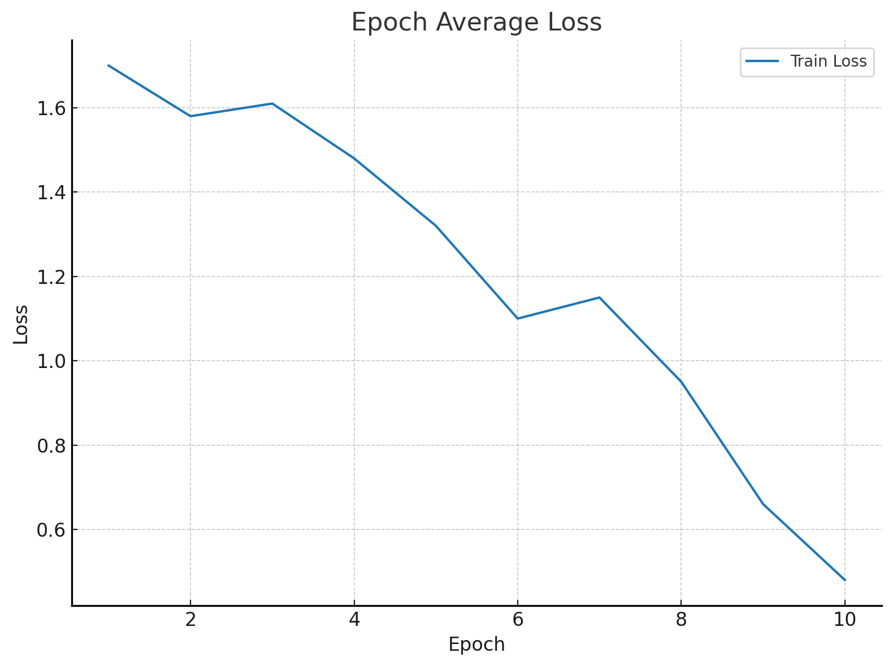

# cura-Swin-UNETR-bts

<p align="center">
  
</p>

# About the Project

CURA is a brain tumor (glioblastoma) segmentation pipeline based on Swin-UNETR. This architecture combines Swin Transformers as encoders with UNet-like decoders. Swin-UNETR hybrid models have achieved top-tier performance in the BraTS (Brain Tumor Segmentation) challenges, including BraTS 2021, thanks to their ability to model both local detail and global context in 3D medical images.

Swin-UNETR outperforms standard convolutional models by employing the self-attention mechanism to detect subtle anatomical structures, making it specifically well-suited for procedures like multi-label tumor segmentation (ET/WT/TC).

Though this specific project (CURA) is based on MONAI's reference Swin-UNETR pipeline, it is also custom-tuned for Apple Silicon (MPS backend) and low-memory systems. Hence, it uses a slim fallback Swin-UNETR variant, with reduced feature maps and trimmed skip connections, so that it is more developer-friendly on laptops or limited hardware.

Here is an example of the original Swin-UNETR architecture:

<p align="center">
  
</p>

# Getting Started

The BraTS '21 task dataset for this pipeline can be found at: https://www.kaggle.com/datasets/dschettler8845/brats-2021-task1

The files will be downloaded in 1251 training + 219 validation .nii.gz (NIFTI) files, and organized into 3 subdirectories (BraTS2021_00495, BraTS2021_00621, BraTS2021_Training_Data). In your main directory, make a "data" directory, such that it is organized:

```bash
cura-Swin-UNETR-bts/
└── data/
    ├── BraTS2021_Training_Data/
    ├── BraTS2021_00495/
    └── BraTS2021_00621/
```
Following, create an "outputs" subdirectory in the main directory. This pipeline will create a .pth file (for the saved model weights) that will be saved in this directory. 

The structure should be:

```bash
cura-Swin-UNETR-bts/
├── data/
│   ├── BraTS2021_Training_Data/
│   ├── BraTS2021_00495/
│   └── BraTS2021_00621/
└── outputs/
    └── swinunetr_model.pth
```

### Features

This pipeline contains the features for:

- Optimized for Apple Silicon (MPS): Full pipeline runs using Metal Performance Shaders (MPS) backend, making it accessible on M-series silicon chips.

- Custom Swin UNETR Variant: lightweight fallback implementation using MONAI’s SwinTransformer encoder with reduced upsampling and memory-aware decoding.

- BraTS 2021 Dataset Loader: Automatically parses BraTS '21 directory structure and stacks FLAIR, T1ce, T1, T2 modalities along with segmentation labels.

- 3D Data Augmentation: Includes random flips, affine rotations, scaling, intensity shifts, Gaussian noise, and cropping tailored for volumetric MRI scans.

- Full MONAI Transforms Pipeline: Data loading, normalization, cropping, augmentation, and typing done via MONAI's flexible Compose and dictionary-based transforms.

- Sliding Window Inference: Supports large-volume inference with MONAI’s sliding_window_inference to handle 3D patch-wise predictions.

- Multi-Metric Validation: Tracks Dice score, Hausdorff95, sensitivity, and specificity across three tumor subregions (ET/WT/TC) at every epoch.

- MPS-aware Training: Uses torch.autocast with AMP-style training to reduce memory usage and enable faster convergence.

- Matplotlib Metric Visualization: Generates plots for training loss, per-channel Dice scores, and validation trends to monitor progression.

- Failsafe Metric Padding & Debugging: tensor padding and detailed console debug outputs to mitigate runtime crashes during aggregation.

## Installation

First, clone the repository:
```bash
git clone https://github.com/myselfadityaranjan/cura-Swin-UNETR-bts.git
cd cura-Swin-UNETR-bts
```

Dependencies can be installed using:
``` bash
pip3 install -r requirements.txt
```

### Running

To run the program, make sure that the dependencies are installed and that the directory structure is organized as is in this repo. Then, in app.py, run the script, and the pipeline will start training the model. 

Parameters like:
```bash
batch_size=1
sw_batch_size=1
overlap=0.35
max_epochs=10
```

can be adjusted based on personal system capabilities and time/memory constraints. 

# Usage

## Training Results (DICE+Loss)

After training this pipeline for 10 epochs on the BraTS 2021 dataset (using the reduced fallback Swin-UNETR variant), the following DICE metrics were observed:

<p align="center">
  
</p>

When averaging the 3-channel metrics:

<p align="center">
  
</p>

Hence, this pipeline achieved a maximum average DICE score of 0.56 with subregion DICE scores of 0.56 (ET), 0.50 (TC), and 0.61 (WT).

### Loss

<p align="center">
  
</p>

As seen, Loss proportionally decreased as DICE increased with per-epoch progression. From an average loss of approximately 1.7 in Epoch 1, Loss reached an expected minimum of 0.47 by Epoch 10. Note that the loss function contained DICE + BCE operations.

Additionally, the mean 95th percentile Hausdorff Distance (HD95) was 7.0 mm, with sensitivity and specificity measures in the high 80s to low 90s in all channels.

Due to Apple Silicon's MPS memory constraints, the model was trained on a smaller batch size and reduced feature maps. Results are indicative of general trends rather than state-of-the-art performance.

## Inference Visualization with WT Tumour-Segmentation Overlays

Below are sample predictions from the trained model (MPS-accelerated fallback Swin-UNETR variant) on two validation FLAIR slices, overlaid with the predicted Whole Tumor (WT) segmentation masks (channel=1):

Sample 1:

<p align="center">
  
</p>

Sample 2:

<p align="center">
  
</p>

This code block contributes to the visualization of the FLAIR slices with WT segmentation masks. Future steps are to visualize ET and TC masks as well:

```bash
with torch.no_grad():
    with torch.autocast(device_type="mps", dtype=torch.float16):
        for batch_data in test_loader:
            outputs = inference_sliding_window(batch_data)
            out_list = decollate_batch(outputs)
            preds = [discrete_mask(post_sigmoid(x)) for x in out_list]
            tumourmask_3ch = preds[0].cpu().numpy()  #shape: (3, d, h, w)

            slice_idx = tumourmask_3ch.shape[1] // 2
            flair_img_nib = nib.load(test_case["image"][0])
            flair_data = flair_img_nib.get_fdata()

            seg_slice = tumourmask_3ch[:, slice_idx, :, :]
            pred_wt = seg_slice[1]

            plt.figure("test inference", (12, 6))
            plt.subplot(1, 2, 1)
            plt.title("flair slice")
            plt.imshow(flair_data[:, :, slice_idx], cmap="gray")
            plt.subplot(1, 2, 2)
            plt.title("predicted wt (channel=1)")
            plt.imshow(pred_wt, cmap="jet", alpha=0.5)
            plt.show()
```

# Testing/Demo Run

A small "dummy dataset" has been provided in the `modalities_sample/` directory in this repo. It contains 5 patient cases, each with the following BraTS '21 modalities:

- FLAIR
- T1
- T1ce
- T2
- Segmentation Mask (seg)

Each patient folder (e.g. `BraTS2021_0XXXX`) contains 5 corresponded .nii.gz (NIFTI) files. 

The structure looks like:

```bash
modalities_sample/
├── BraTS2021_00630/
│   ├── BraTS2021_00630_flair.nii.gz
│   ├── BraTS2021_00630_t1.nii.gz
│   ├── BraTS2021_00630_t1ce.nii.gz
│   ├── BraTS2021_00630_t2.nii.gz
│   └── BraTS2021_00630_seg.nii.gz
├── BraTS2021_00739/
│   └── (similar files)
├── BraTS2021_01426/
│   └── (similar files)
├── BraTS2021_01531/
│   └── (similar files)
└── BraTS2021_01611/
    └── (similar files)
```
## Running a Demo

Similarly to regularly running the program (i.e. as shown earlier), to run a demo with this smaller dataset, simply adjust the data loading directory from `data/BraTS2021_Training_Data/` to:

```bash
data_dir = "./modalities_sample"
```

Then simply run:

```bash
python3 app.py
```
(the entire process is the same as earlier otherwise)

### Purpose of Dummy Data

- Allows quick installation verification without downloading full BraTS 2021 (~20GB).

- Tests model architecture, training loop, and inference flow.

- Useful for MacBooks or MPS systems with limited memory.

- Not intended for final evaluation; real results require full BraTS data (accessable via link provided earlier).

# Roadmap

- [x] Add ONNX export support for model deployment in external applications.
- [x] Enable full BraTS 2021 dataset compatibility for training and evaluation without manual restructuring.
- [ ] Support full-scale Swin-UNETR (without fallback slimming) for larger memory GPUs and servers.
  - [ ] Expand inference outputs to include ET (Enhancing Tumor) and TC (Tumor Core) masks in visualizations.
- [ ] Implement lightweight model checkpoint saving and automatic resumption.
  - [ ] Add mixed-precision (AMP) full support for faster training on all devices.
- [ ] Develop a minimal Streamlit or Gradio web demo for public model testing.
- [ ] Write lightweight unit tests for dataset loading, transforms, and inference modules.

# License

This project is licensed under the MIT License. See the [LICENSE](LICENSE) file for more details.


